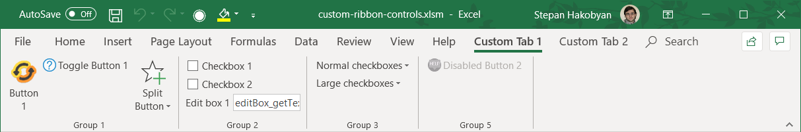
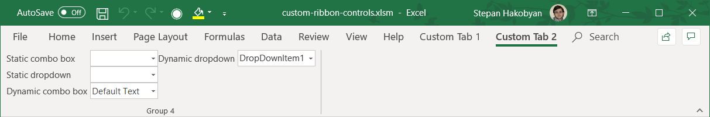

# Custom Ribbon Tabs

## Custom Tab 1

## Custom Tab 2

## Usefull Links
... and how to create custom tabs

### How to Make Custom Ribbons in Excel VBA
https://wellsr.com/vba/2019/excel/how-to-make-custom-vba-ribbons-in-excel/

### Schema
https://docs.microsoft.com/en-us/openspecs/office_standards/ms-customui2/daabc2cd-b3f5-4d32-9099-95d705f70f35

### Chapter 11: Creating Dynamic Ribbon Customizations (1 of 2)
https://docs.microsoft.com/en-us/previous-versions/office/developer/office-2007/dd548010(v=office.12)

### Updating Ribbon Label at Runtime
https://social.msdn.microsoft.com/Forums/sqlserver/en-US/8962f2b5-9b5b-4a4c-a744-dd6cd4988bd8/updating-ribbon-label-at-runtime?forum=exceldev

### Run Time Changes
https://bettersolutions.com/vba/ribbon/run-time-changes.htm

### Ribbon Control Icons
https://bettersolutions.com/vba/ribbon/icons.htm

### 2007 Icon Gallery
https://bettersolutions.com/vba/ribbon/icon-gallery-2007.htm

### This is a list of imageMSO values and associated pictures.
https://bert-toolkit.com/imagemso-list.html

### Office Excel ImageMso Gallery Icons with ScreenTips
https://www.spreadsheet1.com/office-excel-ribbon-imagemso-icons-gallery-page-01.html

